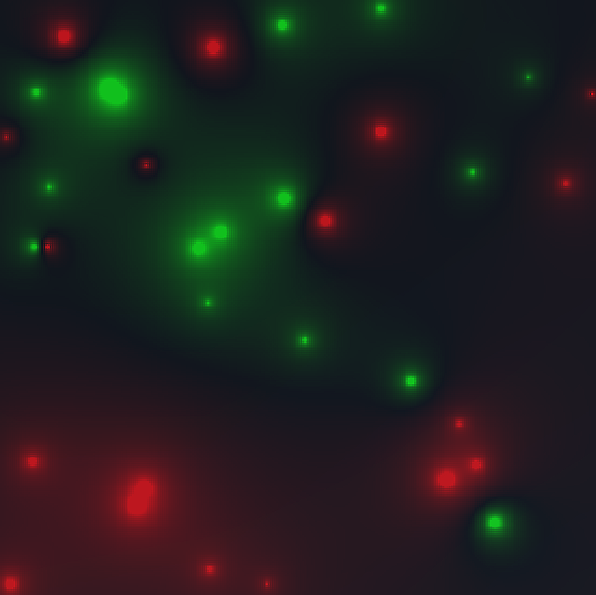
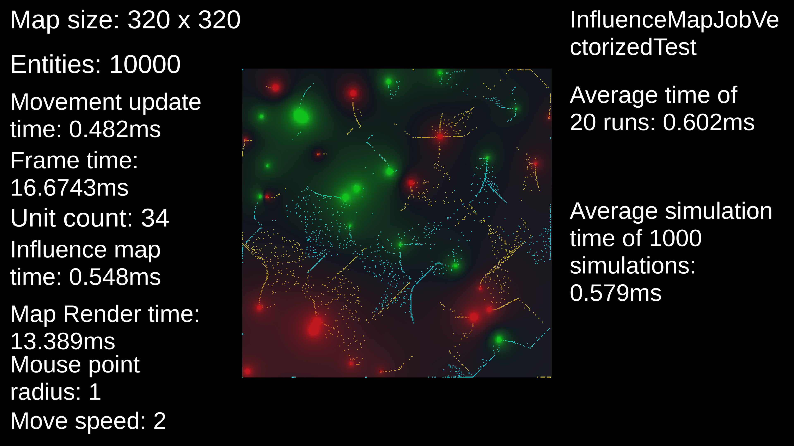

# Unity parallel computing 

### Unity application for testing Unitys parallel computing tools such as Unity Job System and Burst compiler.

- The application benchmarks influence map calculation performance and entity movement simulation performance on the calculated map.

*The application interface shows performance data.*

**Mono and IL2CPP Windows builds available [here](https://drive.google.com/file/d/1QsOTwy7lE2zoYlyzSmz7RmRXaMyeVUOT/view?usp=sharing)**

## Benchmarks

**FOR ACCURATE PERFORMANCE DATA RUN ALL BENCHMARKS IN A BUILD**

Tests 1-4 are run 20 times and an average is reported.

For tests 1-4 a deterministic seed is used for the random number generator for accurate benchmarking.

For entity movement benchmark the next 1000 simulation update times are recorded and an average update time is reported.

All Job System benchmarks use **FloatPrecision.Standard** and **FloatMode.Fast** Burst compiler options.

|Command|Action|
|---|---|
|**Space**|Calculate random map multi-threaded (Job System/BurstCompiler)|
|**1**|Single-threaded benchmark|
|**2**|Single-threaded benchmark (Job System/BurstCompiler)|
|**3**|Multi-threaded benchmark (Job System/BurstCompiler)|
|**4**|Multi-threaded benchmark w/ manual vectorization (Job System/BurstCompiler)|
|**B**|Entity movement benchmark 10000 entities (Job System/BurstCompiler)|

## Input

|Command|Action|
|---|---|
|**Left Mouse Button (+LeftControl for free draw)**|Spawn entities|
|**Right Mouse Button**|Spawn 5000 entities in random positions|
|**Mouse scroll**|Increase/decrease entity brush size|
|**Backspace**|Remove all entities|
|**Up Arrow**|Increase entity move speed|
|**Down Arrow**|Decrease entity move speed|